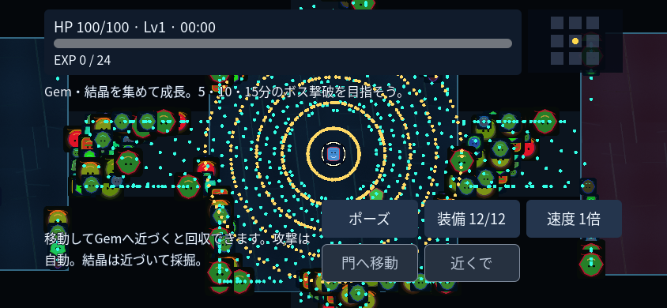

# Gem Survivor Crystal Field v3

結晶迷宮を探索し、敵を倒してジェムを回収し、武器・Passive・進化・連携でビルドを完成させるGodot製サバイバー。



画像はLinux llvmpipeで描画した負荷・レイアウト用fixtureです。実機のゲームプレイ画像ではありません。

**公開alphaです。人間実機の品質ゲートは未達です。** 全履歴を維持してGitHubへpushし、Fast CI・Balance・Performance・Windows/iOS Release buildを実行しています。実際のWindows ZIPとunsigned arm64 IPAを生成・検証済みです。

[alpha.2 Release](https://github.com/jankendo/-gem-survivor-crystal-field-v3/releases/tag/v3.0.0-alpha.3) を今回の配布先とします。Windows ZIP、unsigned IPA、SHA256SUMS、source commit入りRELEASE_MANIFESTと署名READMEを同じSHAから生成します。公開は同じSHAの全必須CI成功後に限定します。alpha.1は以前の不変タグで、今回の変更を含みません。配布前は最新版として扱わないでください。

正本のPUBLIC repositoryは [jankendo/-gem-survivor-crystal-field-v3](https://github.com/jankendo/-gem-survivor-crystal-field-v3) です。先頭のハイフンは正式名称です。v2へwriteしていません。

探索 → 撃破 → ジェム → 成長 → Evolution / Combo → 危険報酬 → Boss。5/10/15分にボス、15分ボス撃破でCLEAR。その後終了またはEndlessを継続できます。

Windows: WASD / 矢印で移動、攻撃は自動。マウス／Enter／Spaceで選択、Tab／矢印／WASDでメニューfocus、Esc／Pでポーズ・再開、1〜3で成長選択。戦闘中Tabで装備、Mで採掘／利用、Eでワープ。UIボタンからも操作できます。iOS: 左側の動的スティックで移動、全選択はタッチ。横画面・Safe Areaを基準とします。

v3は60Hz固定simulation、世代ID付き敵SoA、共有SpatialWorld、Status/Damage所有者、所持武器runtime、起動時GameDatabase、scene UI、v3 atomic saveを導入します。Ultraはworld解像度・装飾だけを変更します。v2由来の名称・アセット・レシピを保持していますが、特殊武器の追尾・反射・吸引・設置・採掘、20種類の名前付きOverclock、6イベント、17Questと購入条件を接続しました。詳細なv2との再設計差分はmigration資料を参照してください。

UIは安定したScene tree・単一モーダル・48pt相当の操作対象を基準とし、文字100/115/125%と描画品質を独立設定できます。HP／ボス表示は最大30Hz、装備／目的／通知は5Hz。保存失敗時は購入をrollbackし、破損した保存データを上書きしません。詳細は[UI/UX監査](docs/qa/UI_UX_AUDIT.md)と[全画面状態matrix](docs/qa/UI_STATE_MATRIX.md)。

図鑑・Questは名前／説明／分類の日本語部分検索、分類・解放状態フィルター、名前／解放／達成率順に対応。8件の行を再利用し、詳細から戻ると条件・ページ・スクロールを復元します。装備12枠から正式名称・実際の能力・次Lv・進化／連携条件を確認できます。成長候補も同じモデルを使用します。時間条件の進化と通路追跡を修正し、Player・攻撃予告を装飾より上の描画層へ移しました。

Godot **4.7 stable** / GDScript / **gl_compatibility**。完全無音。外部著作物は追加していません。

```sh
export GODOT=/path/to/Godot_v4.7-stable_linux.x86_64
python tools/validate_data.py
python tools/run_godot.py --headless --editor --path . --quit
python tools/run_godot.py --headless --path . --script res://tests/test_runner.gd
python tools/run_godot.py --headless --path . --script res://tests/test_runner.gd -- --category=deterministic
python tools/run_godot.py --headless --path . --script res://tests/benchmark.gd -- --mode=balance
python tools/run_godot.py --headless --path . --script res://tests/benchmark.gd -- --mode=performance
python tools/run_godot.py --headless --path . --script res://tests/ui_flow.gd
python tools/run_godot.py --headless --path . --script res://tests/ui_performance.gd
python tools/run_godot.py --timeout-seconds 1800 --headless --path . --script res://tests/gameplay_quality.gd -- --seed=60606
python tools/run_godot.py --timeout-seconds 3600 --headless --path . --script res://tests/long_run.gd -- --ticks=108000
"$GODOT" --path .
```

Install matching Godot export templates, then export:

```sh
mkdir -p builds/windows builds/ios-export
"$GODOT" --headless --path . --export-release "Windows Desktop" builds/windows/GemSurvivorCrystalFieldV3.exe
"$GODOT" --headless --path . --export-release iOS builds/ios-export/GemSurvivor.ipa
```

Windows artifact: `GemSurvivorCrystalField-v3-Windows.zip` contains EXE with embedded PCK and README. iOS artifact: `GemSurvivorCrystalField-v3-unsigned.ipa` requires macOS/Xcode after project export. See [unsigned IPA instructions](IOS_UNSIGNED_README.md): it needs user signing and is not for direct normal-iPhone installation, App Store or TestFlight.

CI workflows separate fast, balance, performance and release. Release validators check real archives and generate SHA-256. 実行済みrunの証拠と制約は [completion gate](docs/qa/COMPLETION_GATE.md) に記録します。

See [architecture](docs/ARCHITECTURE.md), [design](docs/GAME_DESIGN.md), [balance](docs/BALANCE.md), [performance](docs/PERFORMANCE.md), [migration](docs/migration/V2_TO_V3.md) and [QA plan](docs/qa/TEST_PLAN.md). Windows runnerでEXE/PCKのheadless起動を検証しています。Human fun・physical iPhone/iPad・thermal/battery・interactive Windows play remain unverified. Source has no LICENSE; the rights notice does not invent reuse permission.
