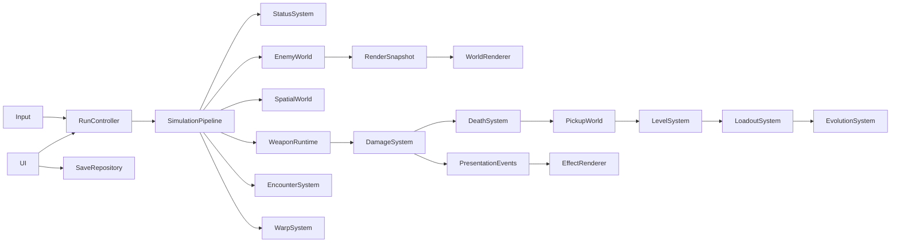

# Architecture

`GameBootstrap` assembles database, persistence, UI and world presentation. Godot physics invokes `SimulationPipeline` at 60Hz; 2x performs two ticks. `RunController.advance` is an accumulator used by replay/QA to drive the same pipeline at arbitrary rendering cadence. Paused/modals/CLEAR stop ticks; presentation continues.

EnemyWorld owns packed positions/velocities/HP/radii/type/behavior/flags/timers/generation, a dense active list and sparse mapping. The low 20 ID bits encode slot; upper bits encode generation. Allocation reserves 600 slots and reuses them without active-list construction. Removed IDs are rejected before use.

SpatialWorld uses five shared layers with packed bucket heads, linked entry indices, positions and IDs. Touched heads are reset once at tick start; query buffers are reused. Query order is deterministic, nearest ties use entity ID. The bounded grid clamps outside ±4096; maps currently stay inside it. Growing maps must resize or redesign this bound.

StatusSystem alone decrements enemy timers; integer ticks avoid repeated floating subtraction. Weapon cooldowns belong to active WeaponRuntime; combo cooldowns to ComboSystem. Their clocks are not enemy statuses. DamageSystem tracks actual HP removed, overkill and source totals. Dead HP cannot generate a second death. Presentation events are bounded and can be dropped without changing results.

GameDatabase reads JSON once, then validates and caches. DataValidator checks runtime recipes and asset paths; Python validation also rejects duplicate JSON keys and invalid probabilities. StatResolver's order is Base → level → character → passive → category → evolution → blessing/contracts → temporary → final; detailed breakdown is opt-in at resolve time.

WorldRenderer receives snapshots. Enemy sprites are bucketed by type into MultiMesh nodes. StaticTerrain caches draw commands until map changes. Critical attack telegraphs read immutable snapshot locations. Only world goes into a scaled SubViewport; HUD/modals/touch remain on root canvas.

No worker threads or native extensions are introduced. Current profiling identifies projectile/spatial preparation as the largest CPU portions; optimize only with unchanged fixtures and parity tests.
